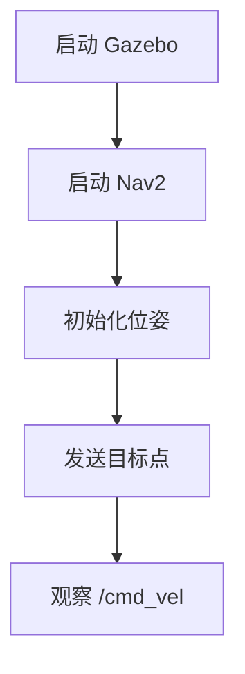
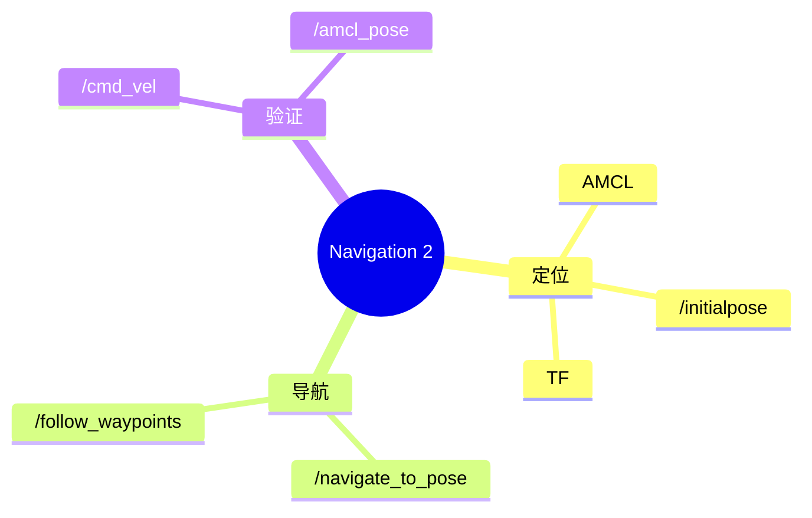

# ROS 2 学习日志写作规范

更新时间：2026-09-15

这个文件不是某一小节的学习笔记，而是以后写 ROS 2 学习日志的统一方法。目标是让笔记不仅能“看懂”，还要能“复现、排错、回忆、迁移”。

## 为什么不按每小节拆文件

推荐组织方式：

```text
notes/
├── ROS2_第6章_机器人建模与仿真学习日志.md
├── ROS2_第7章_自主导航学习日志.md
└── ROS2_学习日志写作规范.md
```

原因：

- 一个章节一个主文件，主线连续，复盘时不用在多个小文件之间跳转。
- 小节用标题层级组织，例如 `## 7.4`、`### 7.4.1`。
- 同一章里的概念、命令、错误、修复经验可以互相引用。
- 后续做项目实践时，可以直接回到对应章节补充，而不是重新开碎文件。

## 每个小节的固定结构

每个小节建议按这个顺序写：

```text
## 7.x 小节标题

### 本节目标
这一节要解决什么真实问题。

### 前置条件
需要已经完成哪些包、地图、参数、话题或环境。

### 核心概念
用自己的话解释 3-5 个关键概念。

### 操作流程
按终端顺序写可复现命令。

### 关键代码
只解释关键代码，不把整段代码重复贴满。

### 验证方法
写清楚怎么判断成功，不只写“运行成功”。

### 常见问题与排查
记录现象、原因、检查命令、修复方法。

### 流程图 / 逻辑图 / 思维导图
用 Mermaid 画系统链路。

### 主动回忆题
合上笔记后能回答的问题。

### 本节结论
用 3-5 行总结学到了什么，下一步是什么。
```

实际写日志时，可以先填“本节目标、操作流程、验证方法、常见问题、本节结论”这 5 块。时间紧的时候先保证可复现，后面再补图和主动回忆题。

## ROS 笔记必须包含的 6 类信息

### 1. 状态

写清楚当前系统状态，而不是只写命令：

```text
当前状态：
- Gazebo 正常发布 /scan、/odom、/tf。
- Nav2 能加载 room.yaml。
- AMCL 能发布 /amcl_pose。
- Nav2 Goal 可以输出 /cmd_vel。
```

### 2. 入口命令

每个功能必须有最短可复现命令：

```bash
cd /home/fishros/chapt6/chapt6_ws
source /opt/ros/humble/setup.bash
source install/setup.bash
ros2 launch fishbot_navigation2 navigation2.launch.py
```

### 3. 验证命令

每个功能都要配检查命令：

```bash
ros2 topic echo /cmd_vel --once --no-daemon
ros2 topic echo /amcl_pose --once --no-daemon
timeout 4 ros2 run tf2_ros tf2_echo map base_footprint
```

### 3.1 命令记录格式

推荐每条关键命令都按下面格式写：

```text
命令：
<实际运行的命令>

作用：
这条命令用来验证什么。

成功现象：
看到什么输出、界面变化或机器人动作，才算成功。

失败时先查：
下一条最小检查命令是什么。
```

示例：

```bash
ros2 action info /navigate_to_pose -t
```

作用：确认 Nav2 单点导航 Action 已经存在，并查看 Action 类型。

成功现象：输出里能看到 action type 是 `nav2_msgs/action/NavigateToPose`。

失败时先查：运行 `ros2 action list`，确认 Nav2 是否已经启动并进入 active 状态。

### 4. 成功标准

不要只写“成功了”，要写可观察证据：

```text
成功标准：
- RViz 能显示地图。
- 机器人模型和 Gazebo 中位置基本对齐。
- 发送 Nav2 Goal 后 /cmd_vel 出现非零速度。
- 放置障碍物后 local costmap 更新，小车能绕行。
```

### 5. 失败经验

错误比顺利流程更值钱。建议用这个格式：

```text
问题现象：
RViz 中没有地图。

初步猜测：
地图没有保存成功，或者 Nav2 没读到地图。

检查命令：
find install/fishbot_navigation2/share/fishbot_navigation2 -maxdepth 3 -type f

真正原因：
源码目录有地图，但 install 目录未同步。

修复：
colcon build --packages-select fishbot_navigation2
source install/setup.bash

以后如何避免：
修改 launch/config/maps 后先构建，再启动。
```

### 6. 迁移理解

每节最后要回答“这个能力以后怎么用于真实机器人”：

```text
迁移理解：
RViz 发 Nav2 Goal 只是调试方式。
真实巡检机器人应该由应用节点调用 /navigate_to_pose 或 /follow_waypoints。
```

## 高效学习 ROS 的方法

### 主动回忆

每节末尾写 3-7 个问题，隔天不看答案回答。

例子：

```text
1. `/initialpose` 是给哪个节点用的？
2. `map -> base_footprint` 能说明什么？
3. `/navigate_to_pose` 的 feedback 里有哪些信息？
4. 为什么重新保存地图后要重新构建包？
```

### 间隔复习

建议节奏：

```text
当天：写日志和主动回忆题。
第 2 天：只看题，不看答案，重新运行关键命令。
第 7 天：复现一次完整流程。
第 30 天：用同一能力做一个小改造，比如修改目标点或新增巡检动作。
```

### 自我解释

每个关键命令下面写一句“为什么需要它”。

不好的写法：

```bash
ros2 topic echo /scan
```

好的写法：

```bash
ros2 topic echo /scan --once --no-daemon
```

作用：确认雷达数据存在；如果 `/scan` 没数据，AMCL 和局部避障都无法正常工作。

### 交错练习

不要一口气只练同一类命令。ROS 学习建议交错练：

```text
Topic -> TF -> Action -> 参数 -> Launch -> RViz 观察 -> 代码调用
```

这样更接近真实排错过程。

## 推荐 Mermaid 图类型

### 流程图

适合记录启动和验证流程。



### 数据流图

适合记录 ROS 节点、话题、Action 之间的关系。

```mermaid
flowchart LR
    Scan[/scan] --> AMCL[amcl]
    Map[/map] --> AMCL
    AMCL --> TF[/tf]
    Goal[/navigate_to_pose] --> Nav2[Nav2]
    Nav2 --> Cmd[/cmd_vel]
```

### 思维导图

适合章节总结。



## 推荐的章节日志骨架

```text
# ROS 2 学习日志：第 x 章 章节名

更新时间：YYYY-MM-DD

## 本章知识地图

## x.1 小节名
### 本节目标
### 前置条件
### 核心概念
### 操作流程
### 关键代码
### 验证方法
### 常见问题与排查
### 主动回忆题
### 本节结论

## x.2 小节名
...

## 本章复盘
### 我现在能独立完成什么
### 我还容易混淆什么
### 下次项目化练习
```

## 当前工程采用的写法

第 7 章统一写在：

```text
notes/ROS2_第7章_自主导航学习日志.md
```

后续建议继续这样追加：

```text
## 7.5 实践项目标题
### 本节目标
### 前置条件
### 操作流程
...
```

`ROS2_学习进度与命令速查.md` 保留各章当前学习入口和按小节整理的命令集合。详细过程仍写在章节学习日志里，避免两个文件互相重复。
