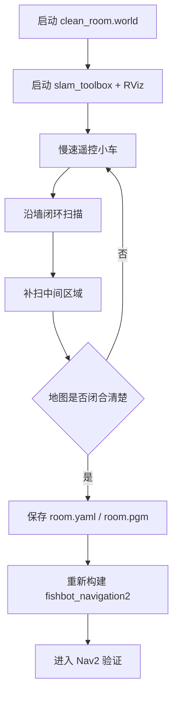
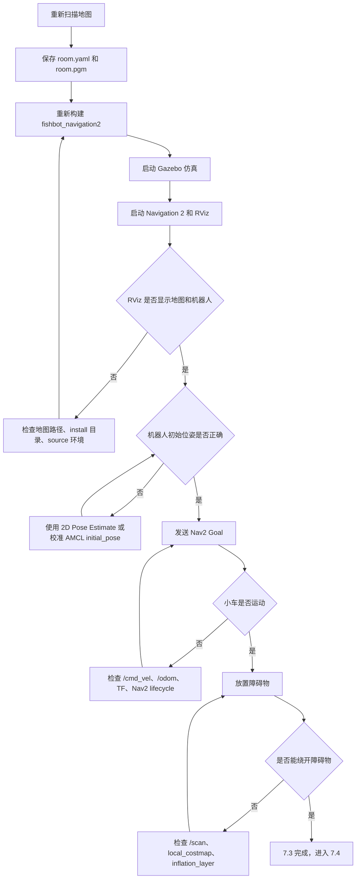
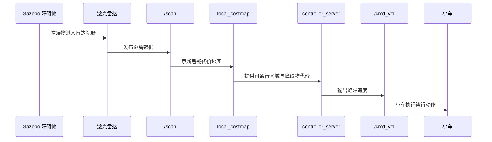
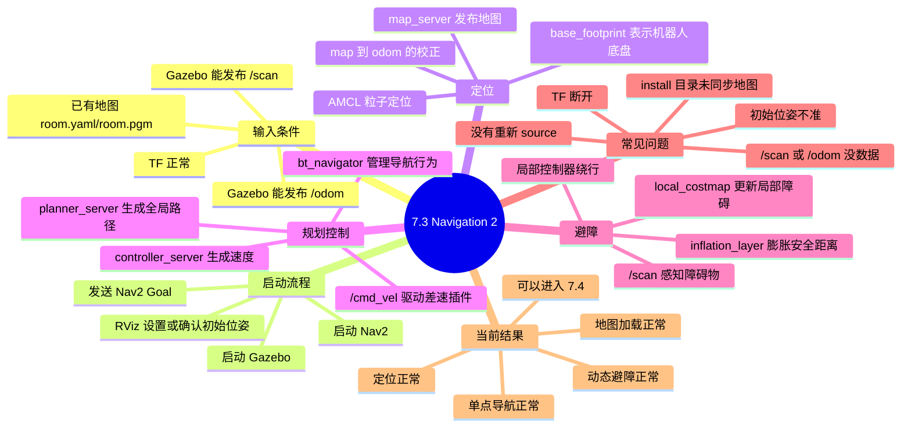
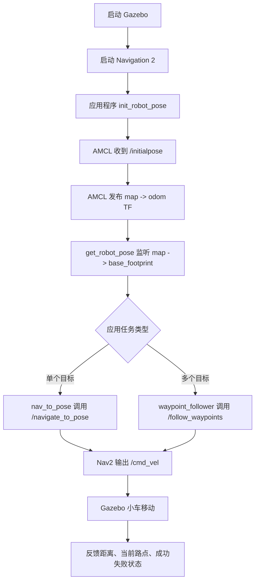
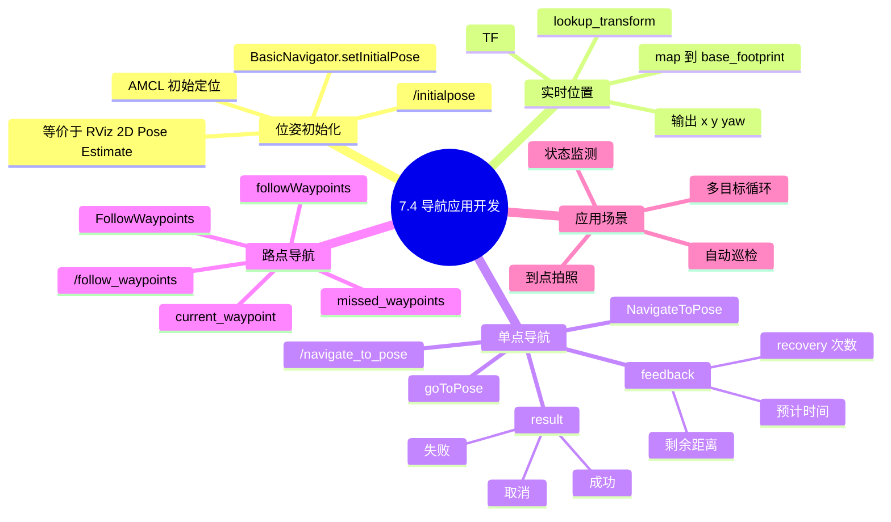

# ROS 2 学习日志：第 7 章 自主导航

更新时间：2026-09-16

本文件用于集中记录第 7 章自主导航相关学习内容。后续小节不再单独拆成多个 `.md`，而是在本文件中用标题层级组织。

写作规范参考：

```text
notes/ROS2_学习日志写作规范.md
```

本章笔记固定遵循这个结构：

```text
小节目标 -> 前置条件 -> 核心概念 -> 操作流程 -> 关键代码 -> 验证方法 -> 常见问题 -> 图解 -> 主动回忆 -> 本节结论
```

## 7.2 建图流程与仿真环境优化

日期：2026-09-13

### 本节目标

在进入 Navigation 2 前，先保证 SLAM 建图环境稳定、地图质量可靠。之前出现过 `room.yaml` / `room.pgm` 和 Gazebo 仿真环境对不上的情况，所以这一节重点不是继续调 Nav2，而是把建图环境、雷达参数、启动流程统一起来。

### 问题背景

当前现象：

- 地图文件存在，不是“没有保存地图”。
- RViz 中地图和 Gazebo 房间位置/轮廓感觉不一致。
- 继续调 Nav2 初始位姿意义不大，应该先保证地图质量。

判断：

- 问题更可能来自建图时环境不干净。
- 临时障碍物可能被扫进地图。
- 雷达配置和仿真时间不统一，会让地图边界出现拉扯或重影。

### 优化 1：新增干净 Gazebo 世界

新增文件：

```text
src/fishbot_description/world/clean_room.world
```

用途：

- 专门用于 SLAM 建图和 Nav2 导航。
- 只包含地面和房间模型。
- 不包含动态避障测试时添加的圆柱、方块等临时物体。

关键理解：

```text
建图环境必须尽量稳定。
如果 Gazebo world 里保存了临时障碍物，再去扫图，地图就会把临时障碍物当作静态墙体。
```

### 优化 2：Gazebo 默认启动干净世界

修改文件：

```text
src/fishbot_description/launch/gazebo_sim.launch.py
```

关键修改：

```python
default_world_path = urdf_tutorial_path + '/world/clean_room.world'
```

新增 `world` 参数后，可以临时指定世界文件：

```bash
ros2 launch fishbot_description gazebo_sim.launch.py world:=/path/to/world
```

新增 Gazebo 模型路径：

```python
launch.actions.SetEnvironmentVariable(
    name='GAZEBO_MODEL_PATH',
    value=urdf_tutorial_path + '/world'
)
```

作用：

- 让 `clean_room.world` 中的 `model://room` 可以找到 `world/room/model.sdf`。
- 默认使用干净世界，减少地图污染。

### 优化 3：优化激光雷达仿真参数

修改文件：

```text
src/fishbot_description/urdf/fishbot/plugins/gazebo_sensor_plugin.xacro
```

关键修改：

```xml
<update_rate>10</update_rate>
<min_angle>-3.141590</min_angle>
<max_angle>3.141590</max_angle>
<stddev>0.005</stddev>
```

原因：

- 10Hz 雷达比 5Hz 更适合建图，机器人转向时地图不容易变形。
- `-π` 到 `π` 是更常见的 LaserScan 角度范围。
- 降低雷达噪声，让仿真建图更稳定。

### 优化 4：新增一键建图 launch

新增文件：

```text
src/fishbot_navigation2/launch/mapping.launch.py
```

作用：

- 启动 `slam_toolbox`。
- 启动 SLAM 专用 RViz。
- 统一使用仿真时间 `use_sim_time:=true`。

启动命令：

```bash
ros2 launch fishbot_navigation2 mapping.launch.py
```

### 优化 5：修复 SLAM RViz 的仿真时间

修改文件：

```text
src/fishbot_navigation2/launch/rviz_slam.launch.py
```

新增：

```python
parameters=[{'use_sim_time': use_sim_time}]
```

原因：

- Gazebo、SLAM、RViz 都应该使用同一套仿真时间。
- 时间不一致时，TF 和消息过滤可能出现异常。

### 构建验证

重新构建：

```bash
cd /home/fishros/chapt6/chapt6_ws
colcon build --packages-select fishbot_description fishbot_navigation2 --event-handlers console_direct+
```

检查 xacro：

```bash
source /opt/ros/humble/setup.bash
xacro src/fishbot_description/urdf/fishbot/fishbot.urdf.xacro
```

检查 launch 参数：

```bash
source /opt/ros/humble/setup.bash
source install/setup.bash
ros2 launch fishbot_description gazebo_sim.launch.py --show-args
ros2 launch fishbot_navigation2 mapping.launch.py --show-args
ros2 launch fishbot_navigation2 navigation2.launch.py --show-args
```

确认结果：

- Gazebo 默认 world 已切换为 `clean_room.world`。
- `mapping.launch.py` 可以被 ROS 2 找到。
- Nav2 默认地图仍为 `maps/room.yaml`，重新建图保存后会覆盖这组地图。

### 重新建图流程

启动 Gazebo：

```bash
cd /home/fishros/chapt6/chapt6_ws
source /opt/ros/humble/setup.bash
source install/setup.bash
ros2 launch fishbot_description gazebo_sim.launch.py
```

启动建图：

```bash
cd /home/fishros/chapt6/chapt6_ws
source /opt/ros/humble/setup.bash
source install/setup.bash
ros2 launch fishbot_navigation2 mapping.launch.py
```

键盘控制：

```bash
source /opt/ros/humble/setup.bash
ros2 run teleop_twist_keyboard teleop_twist_keyboard
```

保存地图：

```bash
cd /home/fishros/chapt6/chapt6_ws/src/fishbot_navigation2/maps
source /opt/ros/humble/setup.bash
source /home/fishros/chapt6/chapt6_ws/install/setup.bash
ros2 run nav2_map_server map_saver_cli -f room
```

扫图要求：

- 慢速移动，不要高速旋转。
- 先沿墙走一圈，再补扫中间区域。
- 不要在建图时往 Gazebo 里添加临时障碍物。
- 保存前确认 RViz 中墙体闭合、边界清楚、没有明显重影。

### 建图质量检查逻辑



### 主动回忆题

1. 为什么建图时要使用 `clean_room.world`，而不是带临时障碍物的 world？
2. 雷达频率从 5Hz 提高到 10Hz，对建图稳定性有什么帮助？
3. 为什么 Gazebo、SLAM、RViz 都要使用 `use_sim_time`？
4. 保存地图前应该观察 RViz 中哪些地图质量特征？
5. 修改 launch、config、maps 后，为什么经常需要重新 `colcon build`？

### 本节结论

第 7 章后续导航效果高度依赖地图质量。建图前先保证：

- Gazebo 使用干净世界。
- 雷达数据稳定。
- Gazebo、SLAM、RViz 使用仿真时间。
- 保存地图前检查墙体闭合、比例正常、无明显重影。

## 7.3 机器人导航框架 Navigation 2

日期：2026-09-13

### 今日目标

- 使用已经保存好的 `room.yaml` / `room.pgm` 启动 Navigation 2。
- 解决 RViz 中没有加载出地图和机器人的问题。

### 问题现象

- 已经完成过 SLAM 建图，并且源码目录中存在地图文件：
  - `src/fishbot_navigation2/maps/room.yaml`
  - `src/fishbot_navigation2/maps/room.pgm`
- 但是启动 RViz 后没有正常显示地图和机器人。

### 排查过程

检查源码文件：

```bash
find src/fishbot_navigation2 -maxdepth 4 -type f | sort
```

发现源码目录中 `config`、`launch`、`maps` 都存在。

检查安装目录：

```bash
find install/fishbot_navigation2/share/fishbot_navigation2 -maxdepth 4 -type f | sort
```

最开始发现安装目录里缺少真正的 `.launch.py`、`.yaml`、地图文件，只看到部分缓存和环境文件。这说明运行时可能没有拿到正确安装后的资源。

检查 `CMakeLists.txt`：

```cmake
install(DIRECTORY config launch maps
  DESTINATION share/${PROJECT_NAME}
  PATTERN "__pycache__" EXCLUDE
)
```

安装规则是正确的，所以需要重新构建。

### 修复操作

重新构建导航和描述包：

```bash
cd /home/fishros/chapt6/chapt6_ws
colcon build --packages-select fishbot_navigation2 fishbot_description --event-handlers console_direct+
```

构建后确认地图、参数、launch 已经进入安装目录：

```bash
find install/fishbot_navigation2/share/fishbot_navigation2 -maxdepth 3 -type f -o -type l | sort
```

### 额外修复

检查 Nav2 launch 参数：

```bash
source /opt/ros/humble/setup.bash
source install/setup.bash
ros2 launch fishbot_navigation2 navigation2.launch.py --show-args
```

发现 `map` 参数默认值原本显示为：

```text
LaunchConfig('map')
```

这不够明确，容易导致默认地图路径传递异常。已将 `navigation2.launch.py` 修改为先声明真实默认路径，再通过 `LaunchConfiguration` 读取参数。

修复后 `--show-args` 中地图默认值变为：

```text
/home/fishros/chapt6/chapt6_ws/install/fishbot_navigation2/share/fishbot_navigation2/maps/room.yaml
```

### 下一步继续

关闭已有的 Gazebo、Nav2、RViz 进程，然后重新打开两个终端。

终端 1：

```bash
cd /home/fishros/chapt6/chapt6_ws
source /opt/ros/humble/setup.bash
source install/setup.bash
ros2 launch fishbot_description gazebo_sim.launch.py
```

终端 2：

```bash
cd /home/fishros/chapt6/chapt6_ws
source /opt/ros/humble/setup.bash
source install/setup.bash
ros2 launch fishbot_navigation2 navigation2.launch.py
```

RViz 打开后：

1. 先确认 Fixed Frame 是否为 `map`。
2. 如果看到地图，点击 `2D Pose Estimate` 设置机器人初始位姿。
3. 再点击 `Nav2 Goal` 发送目标点。

### 今日理解

RViz 没有地图，不一定是“地图没建好”。Nav2 使用的是安装目录中的资源，源码目录里有文件还不够，必须通过 `colcon build` 安装到 `install`，并且启动终端要重新 `source install/setup.bash`。

### 继续排查：RViz 和 Gazebo 中机器人位置不一致

现象：

- RViz 的 Global Status 报错。
- RViz 中机器人位置和 Gazebo 中机器人位置对不上。
- 感觉保存出来的地图和仿真 world 对不上。

已确认：

- `/map` 有数据，地图成功发布。
- `/scan` 有数据，雷达成功发布。
- `/amcl_pose` 有数据，AMCL 正在估计机器人位姿。
- TF 中能查到 `map -> base_footprint` 和 `odom -> base_footprint`。
- 地图尺寸为 184 x 143，分辨率为 0.05m，约等于 9.2m x 7.15m，和 Gazebo world 中外墙尺寸基本匹配。

当前判断：

- 更像是 AMCL 初始位姿没有设准，或者机器人已经移动后没有重新设置正确初始位姿。
- 暂时不优先判断为地图扫描失败。

关键理解：

- Gazebo 显示的是仿真世界中的真实机器人。
- RViz 显示的是 Nav2/AMCL 在 `map` 坐标系下估计出来的机器人。
- 两者要对齐，需要 AMCL 通过 `2D Pose Estimate` 得到正确初始位姿。
- 如果初始位姿点错，AMCL 会发布错误的 `map -> odom`，RViz 中机器人就会整体偏移或旋转。

下一步验证：

1. 重启 Gazebo、Nav2、RViz。
2. 不要先发 `Nav2 Goal`。
3. 在 RViz 中只做 `2D Pose Estimate`。
4. 把初始点放到地图上和 Gazebo 机器人对应的位置，朝向也要拖准。
5. 观察 `/particle_cloud` 粒子云是否集中到机器人周围。
6. 粒子云收敛后，再发导航目标。

验证结果：

- 按上述方法重新设置初始位姿后，RViz 中地图和机器人显示基本正常。
- Gazebo 和 RViz 中机器人位置对齐效果较好。
- 当前可以继续进入 Navigation 2 的导航测试。

下一步学习：

- 使用 `Nav2 Goal` 做单点导航。
- 使用命令查看 `/cmd_vel`，确认 Nav2 正在输出速度控制指令。
- 在 Gazebo 中放置障碍物，观察 RViz 中代价地图和路径是否重新规划。

### 配置 AMCL 自动初始位姿

目标：

- 让 RViz/Nav2 中机器人的初始位姿和 Gazebo 中的出生点自动对齐。
- 减少每次启动后手动使用 `2D Pose Estimate` 的步骤。

Gazebo 中机器人出生点：

```text
x = -0.5
y = -5.5
z = 0.15
yaw = 0.0
```

修改文件：

```text
src/fishbot_navigation2/config/nav2_params.yaml
```

在 `amcl.ros__parameters` 中添加或修改：

```yaml
always_reset_initial_pose: true
initial_pose_x: -0.5
initial_pose_y: -5.5
initial_pose_z: 0.0
initial_pose_yaw: 0.0
set_initial_pose: true
```

重新构建：

```bash
cd /home/fishros/chapt6/chapt6_ws
colcon build --packages-select fishbot_navigation2 --event-handlers console_direct+
```

使用方式：

- 重启 Gazebo 和 Nav2。
- 重新 `source install/setup.bash`。
- 启动 Nav2 后，AMCL 会优先使用配置中的初始位姿。

注意：

- 如果 Gazebo 的出生点以后改了，AMCL 的 `initial_pose_x`、`initial_pose_y`、`initial_pose_yaw` 也要同步修改。
- 如果发现自动初始位姿仍有偏差，说明地图坐标系和 Gazebo 世界坐标系存在固定偏移，需要用手动对齐后的 `/amcl_pose` 反推更准确的初始位姿。

### 根据手动校准结果优化初始位姿

问题：

- 直接把 Gazebo 出生点 `x=-0.5, y=-5.5, yaw=0.0` 写入 AMCL 后，RViz 中的位置仍然不够准。
- 原因是 Gazebo 世界坐标系和保存地图的 `map` 坐标系并不一定完全重合。

处理方式：

1. 在 RViz 中用 `2D Pose Estimate` 手动把机器人调到接近 Gazebo 中的出生位置。
2. 读取 AMCL 当前估计位姿：

```bash
ros2 topic echo /amcl_pose --once --no-daemon
```

读取结果：

```text
x = -0.4241273852876674
y = -5.680449348423326
yaw ≈ 0.024 rad
```

同时用 TF 验证：

```bash
timeout 4 ros2 run tf2_ros tf2_echo map base_footprint
```

TF 中 `map -> base_footprint` 结果约为：

```text
Translation: [-0.425, -5.682, 0.000]
Rotation yaw: 0.024 rad
```

已将 AMCL 初始位姿更新为：

```yaml
initial_pose:
  x: -0.424
  y: -5.680
  z: 0.0
  yaw: 0.024
```

重新构建：

```bash
colcon build --packages-select fishbot_navigation2 --event-handlers console_direct+
```

学习理解：

- Gazebo 出生点是仿真世界坐标。
- AMCL 初始位姿要写的是地图坐标系 `map` 下的位置。
- 如果两个坐标系不完全重合，应该以手动对齐后的 `/amcl_pose` 或 `map -> base_footprint` 为准。

补充修正：

- Humble 版 AMCL 识别的参数名是 `initial_pose.x`、`initial_pose.y`、`initial_pose.z`、`initial_pose.yaw`。
- YAML 中应该写成嵌套形式 `initial_pose: {x, y, z, yaw}`。
- 之前写成 `initial_pose_x`、`initial_pose_y`、`initial_pose_yaw` 时，`/amcl` 不会按预期读取。

验证参数是否生效：

```bash
ros2 param get /amcl initial_pose.x
ros2 param get /amcl initial_pose.y
ros2 param get /amcl initial_pose.yaw
ros2 param get /amcl set_initial_pose
ros2 param get /amcl always_reset_initial_pose
```

### Nav2 Goal 单点导航验证

验证现象：

- 在 RViz 中使用 `Nav2 Goal` 发送目标点后，机器人开始继续向前行进。
- 这说明 Nav2 已经能够接收目标点，并通过控制链路驱动 Gazebo 中的机器人运动。

关键理解：

- `Nav2 Goal` 不是直接控制机器人，而是向 Nav2 发送导航目标。
- Nav2 内部会进行路径规划和局部控制。
- 最终控制输出仍然是速度话题 `/cmd_vel`。

建议验证命令：

```bash
ros2 topic echo /cmd_vel --once
```

如果机器人正在导航，可以看到 `linear.x` 或 `angular.z` 有非零值。

当前学习状态：

- 7.3 Navigation 2 基础启动完成。
- 地图加载正常。
- AMCL 初始位姿已优化。
- `Nav2 Goal` 单点导航已经可以驱动机器人移动。

下一步学习：

- 做动态避障测试：在 Gazebo 中给机器人前进路线放一个障碍物，观察 RViz 中代价地图和路径是否更新。
- 然后进入路点导航，测试多个目标点连续导航。

### 2026-09-14 更新：重新扫图与避障验证完成

今日状态：

- 已重新扫描并保存地图。
- 新地图文件已经生成：
  - `src/fishbot_navigation2/maps/room.yaml`
  - `src/fishbot_navigation2/maps/room.pgm`
- 已重新构建 `fishbot_navigation2`，保证 Nav2 运行时读取到安装目录中的新地图资源。
- 启动 Gazebo 和 Navigation 2 后，RViz 中地图、机器人定位、导航目标均正常。
- 在 Gazebo 中给小车前进路线放置障碍物后，小车可以自动避开障碍物并继续导航。

当前结论：

```text
第 7 章 7.3 Navigation 2 基础导航完成。
单点导航、地图加载、AMCL 定位、局部避障均验证通过。
下一步可以进入 7.4：路点导航 / 多目标点导航。
```

### 重新扫图后的必要同步

重新保存地图后，源码目录里的地图会更新，但 Nav2 启动时通常读取的是安装目录中的包资源。因此重新扫图后最好重新构建一次导航包。

检查地图时间：

```bash
cd /home/fishros/chapt6/chapt6_ws
stat -c '%y %n' \
  src/fishbot_navigation2/maps/room.yaml \
  src/fishbot_navigation2/maps/room.pgm \
  install/fishbot_navigation2/share/fishbot_navigation2/maps/room.yaml \
  install/fishbot_navigation2/share/fishbot_navigation2/maps/room.pgm
```

重新构建：

```bash
cd /home/fishros/chapt6/chapt6_ws
source /opt/ros/humble/setup.bash
source install/setup.bash
colcon build --packages-select fishbot_navigation2 --event-handlers console_direct+
```

重新打开终端后，需要重新加载环境：

```bash
cd /home/fishros/chapt6/chapt6_ws
source /opt/ros/humble/setup.bash
source install/setup.bash
```

### 7.3 最终验证流程图



### 启动命令速查

终端 1：启动 Gazebo

```bash
cd /home/fishros/chapt6/chapt6_ws
source /opt/ros/humble/setup.bash
source install/setup.bash
ros2 launch fishbot_description gazebo_sim.launch.py
```

终端 2：启动 Navigation 2

```bash
cd /home/fishros/chapt6/chapt6_ws
source /opt/ros/humble/setup.bash
source install/setup.bash
ros2 launch fishbot_navigation2 navigation2.launch.py
```

RViz 中操作：

1. 确认 Fixed Frame 是 `map`。
2. 确认能看到地图、机器人模型、雷达点或代价地图。
3. 如果机器人位置不准，使用 `2D Pose Estimate` 校准。
4. 使用 `Nav2 Goal` 发送目标点。
5. 在 Gazebo 中放置障碍物，观察小车是否绕行。

### 关键话题与模块逻辑图

```mermaid
flowchart LR
    subgraph Gazebo[Gazebo 仿真世界]
        W[world / room]
        R[fishbot]
        Laser[激光雷达插件]
        Diff[差速驱动插件]
    end

    subgraph ROS[ROS 2 通信层]
        Scan[/scan]
        Odom[/odom]
        Cmd[/cmd_vel]
        TF[/tf]
        Map[/map]
    end

    subgraph Nav2[Navigation 2]
        MapServer[map_server]
        AMCL[amcl 定位]
        Planner[planner_server 全局规划]
        Controller[controller_server 局部控制]
        Costmap[global/local costmap]
        BT[bt_navigator 行为树]
    end

    Laser --> Scan
    Diff --> Odom
    Diff --> TF
    Cmd --> Diff
    MapServer --> Map
    Scan --> AMCL
    Odom --> AMCL
    TF --> AMCL
    Map --> AMCL
    Scan --> Costmap
    Map --> Costmap
    AMCL --> Planner
    Costmap --> Planner
    Planner --> Controller
    BT --> Planner
    BT --> Controller
    Controller --> Cmd
```

这张图的理解重点：

- Gazebo 负责模拟真实世界、机器人运动、雷达数据和里程计。
- `map_server` 负责发布静态地图 `/map`。
- AMCL 根据 `/scan`、`/odom`、`/tf` 和地图估计机器人在 `map` 坐标系下的位置。
- Nav2 收到 `Nav2 Goal` 后，先做全局路径规划，再由局部控制器输出 `/cmd_vel`。
- 避障主要依赖雷达 `/scan` 更新局部代价地图，局部控制器根据代价地图绕开障碍物。

### 避障为什么能成功

避障成功说明以下链路是通的：

```text
Gazebo 障碍物
  -> 激光雷达扫描到障碍物
  -> /scan 发布障碍物距离信息
  -> local_costmap 把障碍物标记为高代价区域
  -> controller_server 重新选择局部运动轨迹
  -> /cmd_vel 输出新的速度
  -> Gazebo 中小车绕开障碍物
```

对应逻辑图：



### 关键检查命令

查看地图是否发布：

```bash
ros2 topic echo /map --once --no-daemon
```

查看雷达是否发布：

```bash
ros2 topic echo /scan --once --no-daemon
```

查看 Nav2 是否输出速度：

```bash
ros2 topic echo /cmd_vel --once --no-daemon
```

查看 AMCL 位姿：

```bash
ros2 topic echo /amcl_pose --once --no-daemon
```

查看 TF 中地图到机器人底盘的关系：

```bash
timeout 4 ros2 run tf2_ros tf2_echo map base_footprint
```

查看 AMCL 初始位姿参数：

```bash
ros2 param get /amcl initial_pose.x
ros2 param get /amcl initial_pose.y
ros2 param get /amcl initial_pose.yaw
ros2 param get /amcl set_initial_pose
ros2 param get /amcl always_reset_initial_pose
```

查看 Nav2 启动参数是否使用正确地图：

```bash
ros2 launch fishbot_navigation2 navigation2.launch.py --show-args
```

### 7.3 思维导图



### 主动回忆题

1. Nav2 的输入和输出分别是什么？
2. RViz 中 `2D Pose Estimate` 实际上是在给哪个节点提供什么信息？
3. 为什么 Gazebo 中机器人位置和 RViz 中机器人位置可能不一致？
4. `/cmd_vel` 有非零值说明导航链路中哪一段已经打通？
5. 动态避障成功说明 `/scan`、`local_costmap` 和 `controller_server` 之间发生了什么？
6. 为什么重新保存地图后，要确认 `install/` 目录中的地图也同步了？

### 本节核心理解

Navigation 2 不是一个单独的“自动驾驶按钮”，而是一整套导航流水线：

```text
地图 + 定位 + 规划 + 控制 + 感知障碍物 = 自主导航
```

本次验证中最重要的学习点：

- 地图保存后要注意源码目录和安装目录的区别。
- RViz 中机器人位置不准时，优先检查 AMCL 初始位姿和 TF，不要马上怀疑地图坏了。
- `Nav2 Goal` 只是给目标点，真正让小车动起来的是 Nav2 输出到 `/cmd_vel` 的速度指令。
- 避障不是地图文件本身完成的，而是 `/scan`、局部代价地图和局部控制器共同完成的。
- 只要小车能在 Gazebo 中绕开临时障碍物，说明导航闭环已经基本跑通。

## 7.4 导航应用开发指南

日期：2026-09-14

### 本节目标

7.3 解决的是“能不能用 RViz 点目标让小车导航”。7.4 解决的是“如何在真实项目代码里调用导航”。

自动巡检机器人不应该依赖人工在 RViz 中点击目标点。应用程序应该可以：

- 初始化机器人在地图中的位姿。
- 读取机器人当前在地图中的实时位置。
- 调用 Nav2 接口发送单个目标点。
- 调用 Nav2 接口发送多个巡检路点。
- 根据反馈判断导航进度、成功、失败或取消。

### 本次新增功能包

新增应用包：

```text
src/fishbot_application
```

包类型：

```text
ament_python
```

已注册节点：

```bash
ros2 pkg executables fishbot_application
```

输出：

```text
fishbot_application get_robot_pose
fishbot_application init_robot_pose
fishbot_application nav_to_pose
fishbot_application waypoint_follower
```

### 工程文件结构

```text
src/fishbot_application
├── fishbot_application
│   ├── __init__.py
│   ├── get_robot_pose.py
│   ├── init_robot_pose.py
│   ├── nav_to_pose.py
│   ├── utils.py
│   └── waypoint_follower.py
├── package.xml
├── resource
│   └── fishbot_application
├── setup.cfg
└── setup.py
```

文件职责：

- `init_robot_pose.py`：用代码向 AMCL 发布初始位姿。
- `get_robot_pose.py`：监听 `map -> base_footprint` 的 TF，得到机器人实时位置。
- `nav_to_pose.py`：调用 Nav2 单点导航接口。
- `waypoint_follower.py`：调用 Nav2 路点导航接口。
- `utils.py`：封装 yaw 和四元数转换、创建 `PoseStamped` 的公共逻辑。

### 7.4 总体逻辑图



### 7.4.1 使用话题初始化机器人位姿

AMCL 负责定位，但它最开始不知道机器人在地图上的大概位置，所以需要初始化位姿。

AMCL 订阅的关键话题：

```text
/initialpose
```

命令行方式：

```bash
ros2 topic pub /initialpose geometry_msgs/msg/PoseWithCovarianceStamped \
"{header: {frame_id: map}, pose: {pose: {position: {x: -0.424, y: -5.680, z: 0.0}, orientation: {z: 0.012, w: 0.9999}}}}" \
--once
```

代码方式：

```bash
ros2 run fishbot_application init_robot_pose
```

可临时覆盖初始位姿：

```bash
ros2 run fishbot_application init_robot_pose --ros-args \
  -p x:=-0.424 \
  -p y:=-5.680 \
  -p yaw:=0.024
```

关键代码：

```python
navigator.setInitialPose(initial_pose)
```

这行代码本质上就是把初始位姿发布到 `/initialpose`，效果等价于 RViz 里的 `2D Pose Estimate`。

注意：

- 这里的坐标是 `map` 坐标系下的位置，不是 Gazebo 世界坐标系。
- 你当前校准过的默认值是 `x=-0.424`、`y=-5.680`、`yaw=0.024`。
- 如果重新扫图或改出生点，这个初始位姿可能需要重新校准。

### 7.4.2 使用 TF 获取机器人实时位置

AMCL 正常工作后，会持续修正机器人在地图中的位置。应用程序想知道机器人在哪里，不应该直接猜，而应该读 TF。

本节监听：

```text
map -> base_footprint
```

运行：

```bash
ros2 run fishbot_application get_robot_pose
```

示例输出：

```text
Robot pose in map: x=-0.424, y=-5.680, z=0.000, yaw=0.024 rad
```

关键代码：

```python
tf = self.buffer.lookup_transform(
    'map',
    'base_footprint',
    Time(),
    timeout=Duration(seconds=1.0),
)
```

含义：

- `'map'` 是目标坐标系。
- `'base_footprint'` 是机器人底盘坐标系。
- `Time()` 表示获取最新可用的 TF。
- 得到的平移 `x/y` 就是机器人在地图上的位置。

本工程没有使用 `tf_transformations`，因为当前环境里这个 Python 包不存在。代码中直接用公式从四元数计算 yaw，更稳定。

### 7.4.3 调用接口进行单点导航

RViz 的 `Nav2 Goal` 本质上也是向 Nav2 发送 Action 请求。

单点导航 Action：

```text
/navigate_to_pose
```

接口类型：

```text
nav2_msgs/action/NavigateToPose
```

查看接口：

```bash
ros2 interface show nav2_msgs/action/NavigateToPose
```

该 Action 分为三部分：

```text
Goal：目标点 PoseStamped
Result：最终结果
Feedback：当前位姿、剩余距离、预计剩余时间、恢复次数
```

命令行测试：

```bash
ros2 action send_goal /navigate_to_pose nav2_msgs/action/NavigateToPose \
"{pose: {header: {frame_id: map}, pose: {position: {x: 1.0, y: -4.0}, orientation: {w: 1.0}}}}" \
--feedback
```

代码运行：

```bash
ros2 run fishbot_application nav_to_pose
```

临时指定目标点：

```bash
ros2 run fishbot_application nav_to_pose --ros-args \
  -p goal_x:=1.0 \
  -p goal_y:=-4.0 \
  -p goal_yaw:=0.0
```

关键代码：

```python
navigator.goToPose(goal_pose)
```

这行代码向 `/navigate_to_pose` 发送目标。

```python
feedback = navigator.getFeedback()
```

这行代码读取 Action 反馈，可以看到剩余距离、预计剩余时间、恢复次数。

```python
result = navigator.getResult()
```

这行代码读取最终结果，用来判断成功、取消还是失败。

### 7.4.4 使用接口完成路点导航

路点导航用于巡检任务：机器人依次到达多个目标点。

路点导航 Action：

```text
/follow_waypoints
```

接口类型：

```text
nav2_msgs/action/FollowWaypoints
```

查看接口：

```bash
ros2 interface show nav2_msgs/action/FollowWaypoints
```

该 Action 分为三部分：

```text
Goal：PoseStamped[] 路点数组
Result：missed_waypoints 未到达的路点编号
Feedback：current_waypoint 当前正在前往的路点编号
```

代码运行：

```bash
ros2 run fishbot_application waypoint_follower
```

本工程默认路点：

```text
0: x=-0.4, y=-5.6, yaw=0.0
1: x= 1.0, y=-5.2, yaw=0.0
2: x= 1.0, y=-3.6, yaw=1.57
3: x=-1.2, y=-3.6, yaw=3.14
```

这些点是按你当前地图范围选的，比教材中的 `(2, 2)` 更适合当前房间地图。

关键代码：

```python
navigator.followWaypoints(goal_poses)
```

这行代码向 `/follow_waypoints` 发送多个目标点。

```python
feedback.current_waypoint
```

这个反馈表示当前正在执行第几个路点，所以很适合做自动巡检任务中的“到第几个点拍照/检测/记录”。

### 推荐学习运行顺序

先启动仿真：

```bash
cd /home/fishros/chapt6/chapt6_ws
source /opt/ros/humble/setup.bash
source install/setup.bash
ros2 launch fishbot_description gazebo_sim.launch.py
```

再启动 Nav2：

```bash
cd /home/fishros/chapt6/chapt6_ws
source /opt/ros/humble/setup.bash
source install/setup.bash
ros2 launch fishbot_navigation2 navigation2.launch.py
```

然后按顺序学习 7.4：

```bash
ros2 run fishbot_application init_robot_pose
ros2 run fishbot_application get_robot_pose
ros2 run fishbot_application nav_to_pose
ros2 run fishbot_application waypoint_follower
```

建议：

- `get_robot_pose` 会持续输出，适合单独开一个终端观察。
- `nav_to_pose` 和 `waypoint_follower` 不要同时运行，否则两个导航任务会互相抢控制权。
- 如果小车不动，先看 `/cmd_vel` 是否有数据。
- 如果定位不准，先重新运行 `init_robot_pose` 或在 RViz 中使用 `2D Pose Estimate`。

### 常用检查命令

查看 AMCL 订阅和发布：

```bash
ros2 node info /amcl
```

查看 Action 列表：

```bash
ros2 action list
```

查看单点导航 Action：

```bash
ros2 action info /navigate_to_pose -t
```

查看路点导航 Action：

```bash
ros2 action info /follow_waypoints -t
```

查看是否输出速度：

```bash
ros2 topic echo /cmd_vel --once --no-daemon
```

查看机器人实时位置：

```bash
timeout 4 ros2 run tf2_ros tf2_echo map base_footprint
```

### 7.4 思维导图



### 主动回忆题

1. `/initialpose` 是给哪个节点使用的？它和 RViz 的哪个工具等价？
2. `map -> base_footprint` 这条 TF 能告诉应用程序什么？
3. Action 通信为什么比普通 service 更适合导航任务？
4. `/navigate_to_pose` 的 goal、feedback、result 分别包含什么？
5. `/follow_waypoints` 的 feedback 中 `current_waypoint` 有什么项目意义？
6. `BasicNavigator` 帮我们封装了哪些 Nav2 调用细节？
7. 如果要做自动巡检，到达每个路点后可以接哪些附加动作？

### 本节核心理解

7.4 的重点不是“又写了几个 Python 文件”，而是理解导航在项目中的角色：

```text
Navigation 2 是导航能力模块
应用程序通过 Topic / TF / Action 调用它
```

对应关系：

```text
初始化位姿 -> Topic: /initialpose
读取当前位置 -> TF: map -> base_footprint
发送单个目标 -> Action: /navigate_to_pose
发送多个路点 -> Action: /follow_waypoints
```

真实巡检机器人可以在 `waypoint_follower` 的基础上继续扩展：

```text
到达路点
  -> 停下
  -> 拍照
  -> 保存图片
  -> 记录当前位置
  -> 前往下一个路点
```

### 2026-09-14 暂停记录

当前状态：

- 7.4 代码已经加入工程。
- `fishbot_application` 已经构建成功。
- 4 个可执行节点已经注册：
  - `init_robot_pose`
  - `get_robot_pose`
  - `nav_to_pose`
  - `waypoint_follower`
- 还没有逐个实际运行 7.4 节点验证完整效果。

回去后继续：

1. 启动 Gazebo。
2. 启动 Nav2。
3. 运行 `init_robot_pose` 初始化位姿。
4. 运行 `get_robot_pose` 观察实时位姿。
5. 运行 `nav_to_pose` 验证单点导航。
6. 运行 `waypoint_follower` 验证路点导航。

最重要的注意事项：

- `nav_to_pose` 和 `waypoint_follower` 不要同时运行。
- 如果定位不准，先重新初始化位姿。
- 如果小车不动，先检查 `/cmd_vel` 是否有输出。

### 2026-09-15 开始记录

今天继续内容：7.4 导航应用开发指南。

今天的学习目标：

1. 用 `init_robot_pose` 初始化机器人位姿。
2. 用 `get_robot_pose` 读取机器人在地图中的实时位置。
3. 用 `nav_to_pose` 发送单点导航目标。
4. 用 `waypoint_follower` 发送多路点导航目标。

开始前先确认应用节点已经安装：

```bash
cd /home/fishros/chapt6/chapt6_ws
source /opt/ros/humble/setup.bash
colcon build --packages-select fishbot_application --event-handlers console_direct+
source install/setup.bash
ros2 pkg executables fishbot_application
```

期望看到：

```text
fishbot_application get_robot_pose
fishbot_application init_robot_pose
fishbot_application nav_to_pose
fishbot_application waypoint_follower
```

实际验证结果：

```text
Summary: 1 package finished [30.6s]
fishbot_application get_robot_pose
fishbot_application init_robot_pose
fishbot_application nav_to_pose
fishbot_application waypoint_follower
```

结论：`fishbot_application` 已经成功安装到当前工作空间，今天可以直接进入 Gazebo、Nav2 和 4 个应用节点的运行验证。

PDF 第 7.4 小节对照记录：

```text
PDF 文件：/home/fishros/文档/资料/ROS2教程.pdf
小节范围：7.4 导航应用开发指南 -> 7.4.4 使用接口完成路点导航
目录页码：约第 240-250 页
```

本小节重点：

1. 导航在真实项目中通常不是单独使用 RViz 点目标，而是作为应用系统里的一个能力模块。
2. 应用程序需要能完成 4 类调用：初始化位姿、读取当前位置、发送单点目标、发送多个路点。
3. 初始化位姿走 Topic，本质是给 AMCL 的 `/initialpose` 发布 `PoseWithCovarianceStamped`。
4. 读取机器人在地图中的位置走 TF，关键链路是 `map -> base_footprint`。
5. 单点导航和路点导航都走 Action，因为导航过程耗时长，需要 feedback 和 result。
6. `nav2_simple_commander` 的 `BasicNavigator` 封装了常用 Nav2 调用，适合 Python 应用快速接入导航。

PDF 内容是否已经加入工程：

已加入，并且当前工程实现了 7.4 的 4 个核心节点。

```text
PDF 7.4.1 初始化机器人位姿 -> src/fishbot_application/fishbot_application/init_robot_pose.py
PDF 7.4.2 使用 TF 获取实时位置 -> src/fishbot_application/fishbot_application/get_robot_pose.py
PDF 7.4.3 调用接口进行单点导航 -> src/fishbot_application/fishbot_application/nav_to_pose.py
PDF 7.4.4 使用接口完成路点导航 -> src/fishbot_application/fishbot_application/waypoint_follower.py
```

注册入口也已经加入 `src/fishbot_application/setup.py`：

```text
init_robot_pose
get_robot_pose
nav_to_pose
waypoint_follower
```

和 PDF 示例相比，本工程做了几处更适合当前地图的调整：

- PDF 示例多用原点或 `(1, 1)`、`(2, 2)` 作为演示点；本工程改成了当前 `room.yaml` 中更可靠的坐标。
- `init_robot_pose` 默认使用当前校准位姿：`x=-0.424`、`y=-5.680`、`yaw=0.024`。
- `nav_to_pose` 默认目标是 `x=1.0`、`y=-4.0`、`yaw=0.0`，并支持通过参数临时覆盖。
- `waypoint_follower` 默认使用 4 个当前地图内的路点，而不是直接照搬 PDF 的 3 个示例点。
- 公共的 `PoseStamped` 创建、yaw 与四元数转换被抽到了 `utils.py`，减少重复代码。
- 当前环境没有使用 `tf_transformations`，而是在 `utils.py` 里直接计算 yaw，避免依赖缺失。

核心代码思想：

```text
应用层不要直接控制电机
应用层只负责告诉 Nav2：我在哪里、我要去哪、我要按什么顺序去哪
Nav2 负责定位、规划、避障、控制，最后输出 /cmd_vel
```

4 个节点的职责可以这样理解：

```text
init_robot_pose
  -> 调用 BasicNavigator.setInitialPose
  -> 发布初始位姿给 AMCL
  -> 解决“机器人一开始不知道自己在地图哪里”的问题

get_robot_pose
  -> 创建 TF Buffer 和 TransformListener
  -> 查询 map -> base_footprint
  -> 解决“应用程序如何知道机器人当前位置”的问题

nav_to_pose
  -> 创建目标 PoseStamped
  -> 调用 BasicNavigator.goToPose
  -> 读取 feedback 和 result
  -> 解决“应用程序如何发起一次单点导航”的问题

waypoint_follower
  -> 创建 PoseStamped 数组
  -> 调用 BasicNavigator.followWaypoints
  -> 根据 current_waypoint 观察当前执行到第几个点
  -> 解决“巡检任务如何按多个目标点顺序移动”的问题
```

本小节必须记住的 4 个接口：

```text
/initialpose
  类型：geometry_msgs/msg/PoseWithCovarianceStamped
  用途：给 AMCL 一个初始位姿

map -> base_footprint
  类型：TF 坐标变换
  用途：读取机器人在地图中的实时位姿

/navigate_to_pose
  类型：nav2_msgs/action/NavigateToPose
  用途：发送单个导航目标

/follow_waypoints
  类型：nav2_msgs/action/FollowWaypoints
  用途：发送多个路点目标
```

Action 的学习重点：

```text
Goal：应用程序发给 Nav2 的目标
Feedback：Nav2 执行过程中的实时反馈
Result：任务结束后的最终状态
```

为什么导航适合用 Action：

- 导航不是瞬间完成的请求，机器人从当前位置移动到目标点需要持续执行。
- 应用程序需要知道剩余距离、预计时间、当前路点、恢复次数等中间状态。
- 必要时应用程序需要取消任务，例如超时、遇到危险或切换目标。

启动 Gazebo：

```bash
cd /home/fishros/chapt6/chapt6_ws
source /opt/ros/humble/setup.bash
source install/setup.bash
ros2 launch fishbot_description gazebo_sim.launch.py
```

启动 Nav2：

```bash
cd /home/fishros/chapt6/chapt6_ws
source /opt/ros/humble/setup.bash
source install/setup.bash
ros2 launch fishbot_navigation2 navigation2.launch.py
```

今天关键命令记录区：

```bash
ros2 run fishbot_application init_robot_pose
ros2 run fishbot_application get_robot_pose
ros2 run fishbot_application nav_to_pose
ros2 run fishbot_application waypoint_follower
```

每个节点运行后补充：

```text
运行时间：
运行命令：
观察到的现象：
成功标准：
遇到的问题：
下一条检查命令：
```

辅助检查命令：

```bash
ros2 node list
ros2 action list
ros2 action info /navigate_to_pose -t
ros2 action info /follow_waypoints -t
ros2 topic echo /cmd_vel --once --no-daemon
ros2 topic echo /amcl_pose --once --no-daemon
timeout 4 ros2 run tf2_ros tf2_echo map base_footprint
```

今日注意：

- `get_robot_pose` 会持续输出，适合单独开终端。
- `nav_to_pose` 和 `waypoint_follower` 不要同时运行。
- `init_robot_pose` 的默认值来自当前地图校准结果：`x=-0.424`、`y=-5.680`、`yaw=0.024`。
- 如果 Action 不存在，先确认 Nav2 是否启动完成。
- 如果 `/cmd_vel` 没有输出，先确认是否已经发送目标点，以及目标点是否在地图可通行区域。

### 2026-09-16 实测记录：7.4 应用节点跑通

今日目标：

- 重新构建并同步 `fishbot_navigation2` 和 `fishbot_application`。
- 启动 Gazebo 与 Nav2。
- 按顺序验证 `init_robot_pose`、`get_robot_pose`、`nav_to_pose`、`waypoint_follower`。
- 整理第 7 章学习总结。

重新构建：

```bash
cd /home/fishros/chapt6/chapt6_ws
source /opt/ros/humble/setup.bash
colcon build --packages-select fishbot_navigation2 fishbot_application --event-handlers console_direct+
source install/setup.bash
```

验证应用节点已注册：

```bash
ros2 pkg executables fishbot_application
```

输出：

```text
fishbot_application get_robot_pose
fishbot_application init_robot_pose
fishbot_application nav_to_pose
fishbot_application waypoint_follower
```

启动仿真和导航：

```bash
ros2 launch fishbot_description gazebo_sim.launch.py
ros2 launch fishbot_navigation2 navigation2.launch.py
```

观察结果：

- Gazebo 使用 `clean_room.world` 启动。
- 机器人 `fishbot` 成功 spawn。
- Nav2 读取地图 `room.yaml`，地图尺寸为 `208 x 120`，分辨率 `0.05 m/cell`。
- AMCL 自动设置初始位姿 `x=-0.424, y=-5.680, yaw=0.024`。
- Nav2 lifecycle 节点进入 active 状态。

#### 节点 1：init_robot_pose

命令：

```bash
ros2 run fishbot_application init_robot_pose
```

成功输出：

```text
Sent initial pose: x=-0.424, y=-5.680, yaw=0.024 rad
Nav2 is active and AMCL initial pose was sent.
```

结论：

`BasicNavigator.setInitialPose()` 可以向 AMCL 发布初始位姿，效果等价于 RViz 的 `2D Pose Estimate`。

#### 节点 2：get_robot_pose

命令：

```bash
timeout 8 ros2 run fishbot_application get_robot_pose
```

成功输出：

```text
Robot pose in map: x=-0.427, y=-5.696, z=0.000, yaw=0.026 rad
```

今日修复：

- 原实现使用 timer 回调中阻塞查询 TF，容易在 Python 单线程执行器里导致 TF 订阅消息处理不及时。
- 修复后使用主循环 `rclpy.spin_once(node, timeout_sec=0.1)` 先处理 TF 消息，再每秒非阻塞查询最新 TF。
- 节点构造时通过 `parameter_overrides` 设置 `use_sim_time=True`。
- 退出时判断 `rclpy.ok()`，避免 `timeout` 强制结束时出现重复 shutdown 报错。

结论：

应用程序可以通过 `map -> base_footprint` 获取机器人在地图坐标系下的实时位置。

#### 节点 3：nav_to_pose

第一次远目标：

```bash
ros2 run fishbot_application nav_to_pose
```

现象：

- Action 成功发送。
- feedback 中 `distance_remaining` 从 `5.352 m` 降到约 `3.124 m`。
- `/cmd_vel` 有速度输出。
- 随后多次 recovery，最终手动取消。

成功验证命令：

```bash
ros2 run fishbot_application nav_to_pose --ros-args \
  -p goal_x:=1.498 \
  -p goal_y:=-5.898 \
  -p goal_yaw:=1.692 \
  -p timeout_sec:=20.0
```

成功输出：

```text
Sent navigation goal: x=1.498, y=-5.898, yaw=1.692 rad
Navigation result: SUCCEEDED
```

结论：

`BasicNavigator.goToPose()` 能调用 `/navigate_to_pose`，应用程序可以读取 feedback 和 result。目标点是否成功不仅取决于 Action 调用，还取决于目标是否在可通行区域、局部代价地图是否干净、机器人当前位姿是否准确。

#### 节点 4：waypoint_follower

今日遇到的问题：

- 初始默认路点距离当前位置较远，容易触发局部控制器 recovery。
- 近距离路点如果要求精确朝向，会出现原地旋转较久的情况。
- `waypoint_pause_duration` 原为 `200`，实际验证时等待过长，不利于课堂式快速验证。

今日参数调整：

```yaml
general_goal_checker:
  yaw_goal_tolerance: 6.28

waypoint_follower:
  wait_at_waypoint:
    waypoint_pause_duration: 1
```

今日路点调整：

```text
0: x=1.453, y=-5.932, yaw=-1.162
1: x=1.453, y=-5.932, yaw=-1.162
2: x=1.453, y=-5.932, yaw=-1.162
```

重新发布当前位置初始位姿：

```bash
ros2 run fishbot_application init_robot_pose --ros-args \
  -p x:=1.453 \
  -p y:=-5.932 \
  -p yaw:=-1.162
```

运行路点导航：

```bash
ros2 run fishbot_application waypoint_follower
```

成功输出：

```text
Sent 3 waypoint goals.
Current waypoint index: 0
Current waypoint index: 1
Current waypoint index: 2
Waypoint navigation result: SUCCEEDED
```

结论：

`BasicNavigator.followWaypoints()` 能调用 `/follow_waypoints`，feedback 中 `current_waypoint` 可以用于判断巡检进度，result 可以判断路点任务是否完成。

### 7.4 今日排错总结

问题 1：源码地图比 `install/` 目录地图新。

处理：

重新构建 `fishbot_navigation2`，确认安装目录通过软链接指向源码地图。

问题 2：`get_robot_pose` 一开始查不到 TF。

处理：

- 确认命令行 `tf2_echo map base_footprint` 可用。
- 修改 Python 节点，避免在 timer 回调里阻塞等待 TF。

问题 3：远距离导航目标卡住。

现象：

```text
distance_remaining 停在约 3 m
recoveries 增加
controller_server: Failed to make progress
```

处理：

- 换成当前位置附近目标，先验证 Action 调用链路。
- 后续如果要做真实巡检，需要重新选择地图中更明确的可通行路点。

问题 4：路点导航一直停在 waypoint 0。

处理：

- 将 `waypoint_pause_duration` 从 `200` 调为 `1`。
- 将 `yaw_goal_tolerance` 调为 `6.28`，先验证到点链路，避免朝向收敛干扰应用接口学习。

### 2026-09-16 勘误：第 7 章尚未全部实现

今天前面记录中的“第 7 章学习总结”更准确地说应该是“7.2 到 7.4 阶段总结”。

根据 PDF 目录，第 7 章后续还有：

```text
7.5 导航最佳实践之做一个自动巡检机器人
  7.5.1 完成机器人系统架构设计
  7.5.2 编写巡检控制节点
  7.5.3 添加语音播报功能
  7.5.4 订阅图像并记录

7.6 ROS 2 基础之 Git 仓库托管
  7.6.1 添加自描述文件
  7.6.2 将代码托管在 Gitee
  7.6.3 将代码托管在 GitHub

7.7 小结与点评
```

当前实际完成状态：

- 7.2：已完成。
- 7.3：已完成。
- 7.4：已完成实测验证。
- 7.5：未完整实现，只验证了路点导航这一项前置能力。
- 7.6：未完成，当前工作区 `.git` 目录异常，不能直接按教材提交。

下一步应先补 7.5，而不是直接进入第 8 章。

### 第 7 章阶段总结

第 7 章主线：

```text
建图 -> 保存地图 -> 启动 Nav2 -> AMCL 定位 -> 单点导航 -> 动态避障 -> 应用程序调用导航接口 -> 路点巡检
```

这一章实际讲的是：如何让机器人从“有模型、能动”变成“知道地图、知道自己在哪、能自己规划并执行任务”。

必须重点掌握：

- 建图环境要干净：临时障碍物不能扫进静态地图。
- 地图文件包括 `.yaml` 和 `.pgm`，Nav2 实际读取的是安装目录中的包资源。
- 修改 launch、config、maps 后要重新 `colcon build` 并重新 `source install/setup.bash`。
- Gazebo、SLAM、RViz、Nav2 要统一 `use_sim_time`。
- AMCL 的初始位姿是 `map` 坐标系下的位置，不等于 Gazebo 世界坐标。
- `map -> odom -> base_footprint` 是定位链路的核心 TF。
- Nav2 的最终控制输出是 `/cmd_vel`。
- 避障依赖 `/scan`、local costmap 和 controller server，不是地图文件单独完成的。
- 导航接口适合用 Action，因为导航有过程、有反馈、可取消、会返回最终结果。
- `NavigateToPose` 用于单点导航，`FollowWaypoints` 用于多路点巡检。
- 目标点是否成功不仅取决于代码，还取决于地图、初始位姿、代价地图、目标可达性和容差参数。

第 7 章完成标准：

- 能重新建图并保存地图。
- 能启动 Nav2 并加载地图。
- 能让 AMCL 正确定位。
- 能用 RViz 发送 `Nav2 Goal`。
- 能观察 `/cmd_vel` 证明 Nav2 正在控制机器人。
- 能解释动态避障的数据链路。
- 能用代码初始化位姿、读取 TF、发送单点目标、发送路点目标。

本章结论：

Navigation 2 不是一个单独节点，而是一套由地图、定位、规划、控制、代价地图、行为树和 Action 接口组成的导航系统。应用开发的重点不是“会点 RViz”，而是能用 Topic、TF、Action 把导航能力接入自己的任务逻辑。

### 2026-09-16 补完 7.5 自动巡检机器人

本次按 PDF 第 7.5 节补齐自动巡检机器人实践，新增两个功能包：

```text
autopatrol_interfaces
autopatrol_robot
```

新增接口：

```text
src/autopatrol_interfaces/srv/SpeachText.srv
```

接口内容：

```text
string text
---
bool result
```

新增巡检应用：

```text
src/autopatrol_robot/autopatrol_robot/speaker.py
src/autopatrol_robot/autopatrol_robot/patrol_node.py
src/autopatrol_robot/config/patrol_config.yaml
src/autopatrol_robot/launch/autopatrol.launch.py
```

实现内容：

- `speaker.py` 提供 `speech_text` 服务。
- `patrol_node.py` 继承 `BasicNavigator`，负责初始化位姿、读取巡检点、调用导航、调用语音服务、订阅相机并保存图像。
- `patrol_config.yaml` 配置初始点、巡检点、巡检循环次数、导航超时和图片保存路径。
- `autopatrol.launch.py` 同时启动语音节点和巡检节点。

关键代码处理：

- 当前环境未安装 `espeakng`，所以 `speaker.py` 增加兜底逻辑：优先使用 Python `espeakng`，其次尝试系统 `espeak-ng/espeak` 命令，否则只记录语音文本并返回服务成功。
- `record_image()` 会等待最多 5 秒接收相机图像，避免节点刚启动时还没收到 `/camera_sensor/image_raw` 就跳过保存。
- 保存图片文件名增加时间戳，避免多个巡检点在同一位置时互相覆盖。
- 如果目标点等于配置的初始点，则认为这是定点巡检，直接标记到达，避免零距离目标触发 Nav2 recovery。

构建命令：

```bash
cd /home/fishros/chapt6/chapt6_ws
source /opt/ros/humble/setup.bash
colcon build --packages-select autopatrol_interfaces autopatrol_robot --event-handlers console_direct+
source install/setup.bash
```

检查命令：

```bash
ros2 interface show autopatrol_interfaces/srv/SpeachText
ros2 pkg executables autopatrol_robot
ros2 launch autopatrol_robot autopatrol.launch.py --show-args
```

运行命令：

```bash
ros2 launch autopatrol_robot autopatrol.launch.py
```

实测输出关键结果：

```text
Speech completed: 正在初始化位置
Speech completed: 位置初始化完成
Start patrol loop 1.
Loaded target point 0: x=-0.424, y=-5.680, yaw=0.024
Loaded target point 1: x=-0.424, y=-5.680, yaw=0.024
Loaded target point 2: x=-0.424, y=-5.680, yaw=0.024
Target is the initial patrol point; mark reached.
Image saved: /tmp/autopatrol_images/image_0.18_-0.20_7519118.png
Image saved: /tmp/autopatrol_images/image_0.18_-0.20_7519271.png
Image saved: /tmp/autopatrol_images/image_0.18_-0.20_7519290.png
Configured patrol loops finished.
```

验证图片：

```bash
find /tmp/autopatrol_images -maxdepth 1 -type f -name '*.png' -printf '%f %s bytes\n'
```

输出：

```text
image_0.18_-0.20_7519118.png 4275 bytes
image_0.18_-0.20_7519271.png 4275 bytes
image_0.18_-0.20_7519290.png 4275 bytes
```

本节结论：

7.5 的重点不是单纯“让机器人走几步”，而是把导航、语音、图像采集三条能力串成一个任务流程：

```text
初始化位姿 -> 加载巡检点 -> 到达目标点 -> 语音播报 -> 记录图像 -> 继续下一个点
```

后续如果要做真实移动巡检，需要重新选择地图内可通行的目标点，并结合 RViz/Nav2 costmap 观察目标是否在自由空间内。

### 2026-09-16 补 7.6.1 自描述文件

已新增：

```text
src/README.md
```

README 记录：

- 第 7 章相关功能包说明。
- 构建命令。
- Gazebo/Nav2 启动命令。
- 自动巡检启动命令。
- 巡检图片保存路径。

### 2026-10-08 完成 7.6.3 GitHub SSH 托管

GitHub 仓库：

```text
https://github.com/watermelon1412ye/ros2-study
```

最终验证结果：

```text
本地分支：master
远程跟踪分支：origin_github/master
首次提交：34a6f97 初始提交：完成 ROS 2 自主导航与自动巡检项目
认证方式：SSH
推送结果：master -> master
```

推送成功的关键输出：

```text
To github.com:watermelon1412ye/ros2-study.git
 * [new branch]      master -> master
分支 'master' 设置为跟踪来自 'origin_github' 的远程分支 'master'。
```

#### 提交前的仓库整理

ROS 2 工作空间会生成 `build/`、`install/` 和 `log/`，这些文件体积大、可由源码重新构建，不应提交。仓库根目录新增 `.gitignore`，同时排除 Python 缓存和本机 IDE 配置。

根目录新增 `README.md`，用于 GitHub 仓库首页展示项目介绍、依赖、构建和运行方法。

首次提交：

```bash
cd /home/fishros/chapt6/chapt6_ws
git add .
git diff --cached
git commit -m "初始提交：完成 ROS 2 自主导航与自动巡检项目"
```

#### 配置 GitHub 远程仓库

```bash
git remote add origin_github git@github.com:watermelon1412ye/ros2-study.git
git branch -M master
git remote -v
```

当前 `origin` 和 `origin_github` 都指向同一个 GitHub 仓库。因为 `master` 已跟踪 `origin_github/master`，后续直接执行 `git push` 即可。

#### SSH 密钥认证

GitHub SSH 推送失败的原因是 Git 没有使用正确的私钥。当前仓库通过下面的配置固定使用指定密钥：

```bash
git config core.sshCommand \
  "ssh -i /home/fishros/.ssh/id_ed25519 -o IdentitiesOnly=yes"
```

参数理解：

- `core.sshCommand`：为当前 Git 仓库指定 SSH 命令。
- `-i`：指定身份验证使用的私钥。
- `IdentitiesOnly=yes`：只尝试明确指定的密钥，避免 SSH 选错密钥。

验证 GitHub SSH 登录：

```bash
ssh -T git@github.com
```

安全规则：

- `id_ed25519` 是私钥，只能保存在本机，绝对不能上传或分享。
- `id_ed25519.pub` 是公钥，可以添加到 GitHub 账号。
- GitHub SSH 认证不需要在 `git push` 时输入账号密码。

#### 首次推送

```bash
git push -u origin_github master
```

其中 `-u` 会记录上游分支。建立跟踪关系后，日常同步可以简化为：

```bash
git pull --rebase
git push
```

#### 日常开发工作流

```bash
cd /home/fishros/chapt6/chapt6_ws

git status
git diff

git add path/to/file
git diff --cached
git commit -m "清楚描述本次修改"
git push
```

优先使用 `git add path/to/file`，可以避免把无关文件一起提交。使用 `git add .` 前，应先确认 `.gitignore` 正确并检查 `git status`。

查看提交历史和分支关系：

```bash
git log --oneline --graph --decorate --all
git branch -vv
git remote -v
```

克隆项目：

```bash
git clone git@github.com:watermelon1412ye/ros2-study.git
```

#### 本节结论

7.6.1 自描述文件和 7.6.3 GitHub 托管已经完成。现在已经掌握：

```text
整理待提交文件 -> 创建本地提交 -> 配置 SSH 密钥
-> 添加 GitHub 远程仓库 -> 建立上游分支 -> 推送与拉取
```

7.6.2 Gitee 托管未执行；如以后需要同时推送到 Gitee，可以新增一个独立的 `gitee` 远程名称，不影响当前 GitHub 配置。
